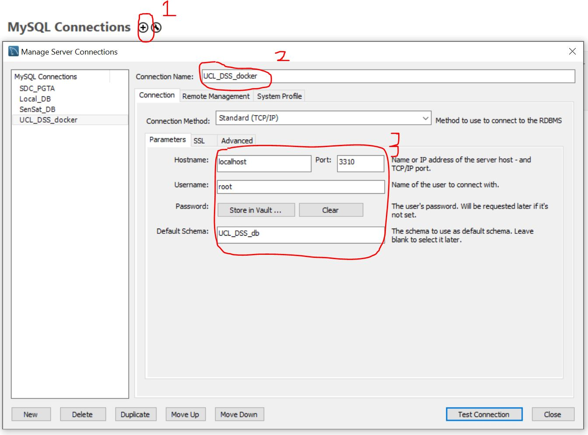
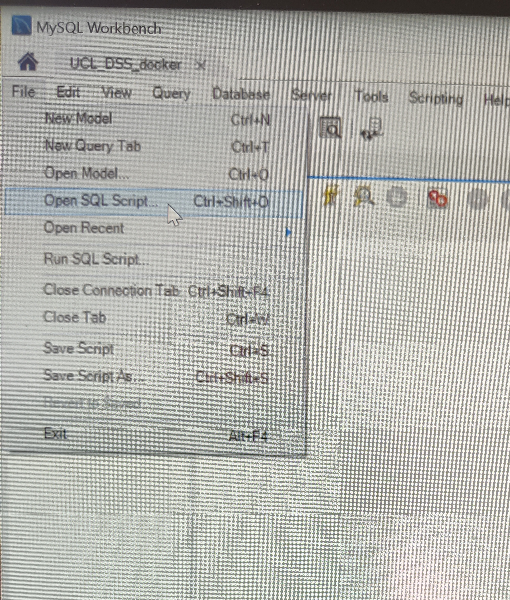

# SQL_workshop

An introduction into SQL through MYSQL.

>***Author:*** Philip Wilkinson Head of _Science_ (21/22)

>***Contact:*** philip.wilkinson.19@ucl.ac.uk

>***Difficulty***: 2/5 ~ 3/5

>***Prerequisite***: `PY01` or basic Python syntax. Experience with `list`, `tuple`, `set` and `dictionary` is desirable, but we will take a closer look into the details.

## Description

In this workshop we will cover the basics of SQL, a key fundamental skill for any data scientist looking to develop their data science skills. This will take a close look at pushing data to SQL, querying that data and gaining meaningful insights from it. By the end of this workshop you will be familier with the basics of SQL and will be ready to start learning some more advanced techniques.

## Software prerquisites
- Python 3
- Anaconda
- Jupyter Notebook 
- [Git Bash](https://git-scm.com/downloads) for Windows users (mac users can also use this but should be able to use the terminal)
- [Docker](https://www.docker.com/products/docker-desktop)
- [MYSQL workbench](http://dev.mysql.com/downloads/workbench/)

## Structure

```shell
.
├── PY02 - Data Structures
│   ├── README.md
│   ├── prep.ipynb
│   ├── workbook.sql
│   ├── Data
        ├── single.csv
        ├── double.csv
    ├── Docker
        ├── docker-compose.yml

```

## Start-up instructions

Once all the necessary software has been downloaded. Using Git Bash or Mac Terminal navigate to the directory that has the docker-compose.yml file. Once you have navigated to that directory as seen in the picture below, then use the command `docker-compose up`. This command will then load the docker container that will create the MYSql database for you to connect to.


This may take a while, especially for this first time. But once the loading has been completed, you can then access the [prep.ipynb](prep.ipynb) workbook which will tell you how to load the data into MySQL.

Once this has been done, we can then use MYSQL Workbench to be able to access the database that you created. In order to connect to the database you will want to open up MYSQL workbench, click on the add connection sign labelled as 1 in the picture below. Set the name of the connection as you want, I called this UCL_DSS_docker. You can then fill in the connection details as in number 3. The password for this comes from the docker-compose.yml file and can be changed to fuit what you want, but for not it is `UCL_DSS`. Test the connection an then you can create the connection.



Once this has been completed and a connection has been made, you can then enter the connection and load in the workbook.sql script which will be the basis for the workshop and also the supplementary questions for after the workshop as well. This can be done as in the following image:



Where you then navigate to the [workbook.sql](workbook.sql) script which will be used in the practical.